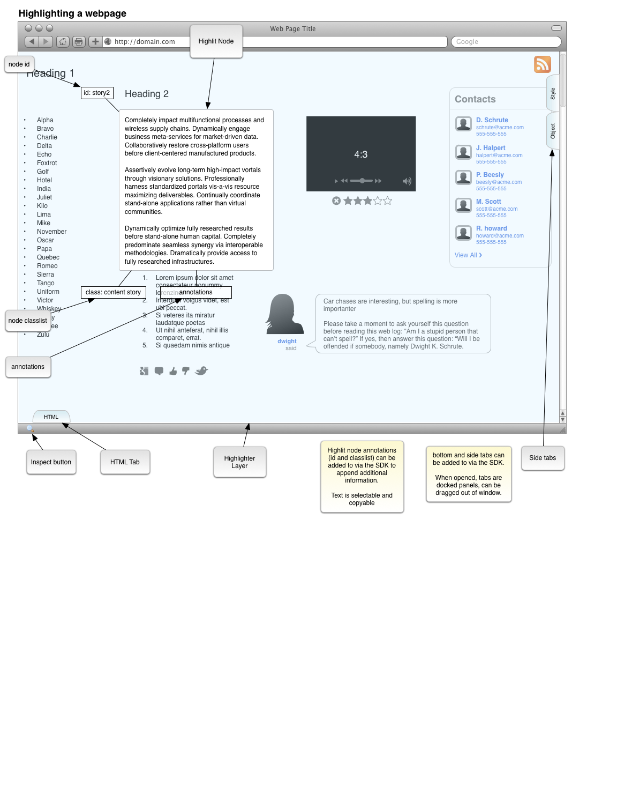

# Highlighter Usage #

## A Story ##

Web Developer extraordinaire Petraeus Maximus loads his web page into Firefox to view it. He notices that the alignment on one of the divs is off by a couple of pixels so he fires up the Highlighter by clicking on the inspect button in the toolbar and hovering over the div he's interested in. Once highlighted, he clicks on the div which reveals the associated annotations and reveals the tabs for the various side panels.

Since Petraeus' interested in checking the alignment on this div, he opens the Style panel by clicking the tab on the side of the highlighter area. Everything looks reasonable, so he continues searching for the source of the offset in the adjacent nodes. Clicking outside his selected node in the highlighter area reactivates selection mode and he's able to hover over a spacer div next to the node he was originally highlighting. He clicks it, views the style and notices a margin declaration that causes his problem.

## Annotations ##

(not sure what to call them, stickies or hangers-on doesn't sound particularly appealing. Tags could be confusing.)

Often, when one is using a traditional inspector, the HTML panel is useful for getting the ID of an element or inspecting classes. It's useful to get these to look them up in the source document, or provide a key to pass to a function in jQuery or using a DOM lookup. Making these visible through light, floating tags attached to the selected node makes them readily visible without having the bulk and screen space of a loaded HTML panel.

Providing an API to allow extension authors to create their own annotations could be useful as well, e.g., in the context of a JS library.

Not sure how best to display these. They're currently shown the same way as the ID and Class tags are. Some alternative suggestions could be a window blind / shade to expand and collapse them, or draw the text over the highlighter background.

## Side/Edge Panels ##

A base set of panels should be available for users. The standard HTML, Style and DOM panels would make sense. But what if a developer wants to create their own? Having an API to create these panels associated with the Highlighter inspector could be useful for add-on authors.

## Selection ##

Some nicer controls for selecting Parents, Siblings and Children might be useful (not pictured). Additionally, some selection controls for selecting floats, or elements with absolute position could be useful as well. One nice ability with a full screen highlighter like this is that we should be able to highlight certain classes of element and "do things" with that group.

Examples might be, export them as a list or manipulate them directly showing unions of style rules or only the intersections.

### Z-order selection ###

It could be useful to select items beneath the visible node. Some mechanism to select hidden elements would be ideal preferably using the mouse. (one possibility: use mouse-wheel while hovering to ascend/descend through z-order)
toggling pseudo-classes

### Pseudo-classes ###

Having a means to cycle through (and lock) :hover and :active states would be useful, if applicable. Maybe they should be displayed as clickable areas around the highlighted node?
